# 1.hello word

## 1.1.交互式

1. python 2.7

   

2. python 3.8

   


## 1.2.使用命令行


# 2.基本语法

## 2.1.number

1. int（有符号整型）

   >```python
   ># 无前缀默认10进制
   >a = 10
   ># 2进制的前缀 "0B"
   >b = 0B10
   ># 8进制的前缀 "0O"
   >c = -0O10
   ># 16进制的前缀 "0X"
   >d = 0X10
   >print a, type(a)
   >print b, type(b)
   >print c, type(c)
   >print d, type(d)
   >```
   >
   >结果：

2. long（长整型）

   >长整型也可以使用小写 l，但是还是建议您使用大写 L，避免与数字 1 混淆。Python使用 L 来显示长整型。
   >
   >```python
   ># 无前缀默认10进制
   >a = 10L
   ># 2进制的前缀 "0B"
   >b = 0B10L
   ># 8进制的前缀 "0O"
   >c = -0O10L
   ># 16进制的前缀 "0X"
   >d = 0X10L
   >print a, type(a)
   >print b, type(b)
   >print c, type(c)
   >print d, type(d)
   >```
   >
   >结果：

3. float（浮点型）

   >```python
   >a = 1.0
   >b = 2e2
   >print a, type(a)
   >print b, type(b)
   >```
   >
   >结果：

4. complex（复数）

   >**复数由实数部分和虚数部分构成，可以用 a + bj ,或者 complex(a,b) 表示， 复数的实部 a 和虚部 b 都是浮点型**
   >
   >```python
   >a = (1 + 2j)
   >print a, type(a), type(a.real), type(a.imag)
   >b = (1e2 + 2e2j)
   >print b, type(b), type(b.real), type(b.imag)
   >```
   >
   >结果：

## 2.2.string

```python
s = "span"
# 顺数第一个
print s[0]
# 倒数第一个
print s[-1]
print s[len(s) - 1]
```

结果：

### 2.2.1.切片


```python
s = "span"
# [1,3)左闭右开  等价s[slice(1,3)]
print s[1:3]
# 切片中，左边的默认为0，右边的默认为len(s)
print s[:2]  # s[0:2]
print s[2:]  # s[2:len(s)]
print s[2:len(s)] == s[2:]

# [0,-1) --> [0,len(s)-1) --> s[0:len(s)-1]
print s[:-1]
print s[0:len(s) - 1] == s[:-1]

# 实现拷贝
s2=s[:]
```

结果：

------

```python
s = "abcdefghijk"
# 步进为2
print s[1:8:2]
# 步进为-1时代表从后往前
print s[::-1]
# 逆着打印
print s[8:2:-2]
```

结果：

### 2.2.2.不可变性

```python
s = "span"
s[0] = "a"
```

结果：


### 2.2.3.字符串中的变量

```python
s = "are"
s2 = "Hello"
n3 = 9527
print "%s!!! How %s you !!!  %d" % (s2, s, n3)
```

结果：

### 2.2.4.help

```python
s = "span"
# 返回对象的所有属性和方法
print dir(s)
```

结果：

其实就是：


```python
s = "span"
# 查询某个方法是干啥的
print help(s.replace)
```

结果：


### 2.2.5.转义

>字符串在交互模式下  \n 等字符以转义字符显示，在print打印下会将其解释出来


### 2.2.6.Ascii和字符转换

```python
print ord("s")
print chr(115)
```

结果：

### 2.2.7.修改字符串

```python
s = "abcabc"
# 方法1不可行
try:
    s[1] = "c"
except Exception as e:
    print e
print s
# 方法2有缺陷
s = s.replace("b", "c")
print s
# 方法3貌似可行
s = s[:1] + "b" + s[2:]
print s
# 方法4貌似可行
L = list(s)
L[0] = "c"
s = "".join(L)
print s
```

结果：

## 2.3.list

```python
# 类似java的数组，但是没有类型约束
L = [1, "2", 3.0]
print L
for v in L:
    print type(v)
# 列表和字符串一样，同样支持切片
print L[:1]
print L[:-1]
# 列表还支持相加
print L + ["465", 123]  # 返回一个新列表
print L
```

结果：

### 2.3.1.列表嵌套

```python
# 变为二维数组
L = [[1, "2", 3.0],
     [4, "5", 6.0],
     [7, "8", 9.0]]
print L[0]
print L[1][2]
```

结果：

### 2.3.2.列表常见操作


## 2.4.dic

```python
d = {"a": 1, "b": 2, "c": 3.0}
# 通过key拿value
print d["a"], d.get("a", None)
# 修改字典
d["b"] = "3"
# 遍历字典
for k, v in d.items():
    print "key: ", k, "value: ", v
for k in d.keys():
    print k,
print
for v in d.values():
    print v,
```

结果：

### 2.4.1.字典的创建方式


### 2.4.2.字典的常见操作


## 2.5.tuple

```python
t = (200, 50)
for v in t:
    print v,

# 由于元组的不可变性，修改值会报错
t[0] = 100
```

结果：

### 2.5.1.元组常见操作


## 2.6.set

```python
x = set("abcde")
y = set("cdxyz")
print x
print y

print x | y
print x & y
print x - y
print x ^ y  # 去掉相同的
print x > y
```

结果：

## 2.7.Generator

> 在 Python 中，使用了 yield 的函数被称为生成器（generator）。
>
> 跟普通函数不同的是，生成器是一个返回迭代器的函数，只能用于迭代操作，更简单点理解生成器就是一个迭代器。
>
> 在调用生成器运行的过程中，每次遇到 yield 时函数会暂停并保存当前所有的运行信息，返回 yield 的值, 并在下一次执行 next() 方法时从当前位置继续运行。
>
> 调用一个生成器函数，返回的是一个迭代器对象。

以下实例使用 yield 实现斐波那契数列：

```python
import sys


def fibonacci(n):  # 生成器函数 - 斐波那契
    a, b, counter = 0, 1, 0
    while counter < n:
        yield a
        a, b = b, a + b
        counter += 1


f = fibonacci(10)  # f 是一个迭代器，由生成器返回生成

while True:
    try:
        # 末尾加 "," 去掉 \n
        print next(f),
    except StopIteration:
        sys.exit()
```

结果：

### 2.7.1.Generator配合for

```python
s = "spam"

offset = 0
for v in s:
    print v, "appears at offset ", offset
    offset += 1

# enumerate返回一个生成器generator
# for会自己调用next(generator)
for (offset2, v) in enumerate(s, start=0):
    print v, "appears at offset ", offset2
```

结果：

## 2.8.解析表达式

1. list解析

   >```python
   ># 变为二维数组
   >L = [[1, "2", 3.0],
   >     [4, "5", 6.0],
   >     [7, "8", 9.0]]
   >
   >for a in L:
   >    print a
   ># 列表解析
   >R = [a[1] + "1" for a in L if a[1] == "5"]
   >print R
   >```
   >
   >结果：

2. set解析

   >```python
   ># 变为二维数组
   >L = [[1, 2, 3.0],
   >     [4, 5, 6.0],
   >     [7, 8, 9.0]]
   >
   >G = {sum(c) for c in L}
   >print type(G)
   >print G
   >```
   >
   >结果：

3. dic解析

   >```python
   ># 变为二维数组
   >L = [[1, 2, 3.0],
   >     [4, 5, 6.0],
   >     [7, 8, 9.0]]
   >
   >M = {i: sum(L[i]) for i in range(len(L))}
   >print type(M)
   >print M
   >```
   >
   >结果：

4. generator解析

   >```python
   ># 变为二维数组
   >L = [[1, 2, 3.0],
   >     [4, 5, 6.0],
   >     [7, 8, 9.0]]
   >
   >G = (sum(c) for c in L)
   >print type(G)
   >for v in G:
   >    print v,
   >```
   >
   >结果：

## 2.9.bool

- 数字如果为非零，则为真
- 其它对象如果为非空，则为真

```python
a = 0.0
print bool(a)
b = 0
print bool(b)
c = 2
print bool(c)
d = "spam"
print bool(d)
e = []
print bool(e)
f = {}
print bool(f)
f["a"] = "aaa"
print bool(f)
g = None
print bool(g)
```

结果：

# 3.文件

```python
# r:读模式 w:写模式 a:追加模式 r+:读写模式
with open("log.txt", "r") as f:
    print f.read()
```

结果：

## 3.1.文件常见操作


# 4.类

```python
# 全局变量
global_val = 10


class Test(object):
    static_val = 20

    def __init__(self, a):
        # 成员变量
        self.a = a

    def m(self, name):
        name = 2 * name
        print name


if __name__ == '__main__':
    t = Test(30)
    t.m("test")
    print global_val
    print Test.static_val
    print t.a
```

结果：

# 5.操作符

```python
yield x  # 生成器函数发送协议
lambda args: expression  # lambda表达式
x if y else z  # 如果y为真返回x,否则返回z
x or y  # 逻辑或（只有x为假才会计算y）
x and y  # 逻辑与（只有x为真才会计算y）
not x  # 逻辑非
x in y, x not in y  # 成员关系（可迭代对象，集合）
x is y, x is not y  # 对象地址是否相等
x == y # 对象值是否相等
x | y  # 位或，集合并集
x ^ y  # 位异或，集合对称差
x & y  # 位与，集合交集
x << y, x >> y  # 逻辑左右移
x * y  # 乘法或重复
x % y  # 取余或格式化
x // y  # 在 Python 2.X 和 Python 3.X 中，X // Y 对应的向下取整除法表达式总是会把商的小数部分去掉。
x / y  # 除法 #在 Python 3.X 中，X / Y 表达式会执行真除法（保留了商的小数部分），在 Python 2.X 中，X / Y 表达式会执行经典除法（截断为整数）
~x  # 按位取反
x ** y  # 幂运算
```

# 6.Decimal

```python
import decimal

print decimal.Decimal(1) / decimal.Decimal(7)

# 修改全局精度
decimal.getcontext().prec = 2
print decimal.Decimal(1) / decimal.Decimal(7)
```

结果：

```python
import decimal

# 修改局部精度
with decimal.localcontext() as d:
    d.prec = 2
    print decimal.Decimal(1) / decimal.Decimal(7)

print decimal.Decimal(1) / decimal.Decimal(7)
```

结果：

# 7.分数

```python
import fractions

x = fractions.Fraction(1, 3)
print x

y = fractions.Fraction(2, 6)
print y

z = fractions.Fraction(0.25)
print z
```

结果：

# 8.拷贝

## 8.1.列表拷贝

```python
# 列表拷贝
a = [1, 2, 3]
b = a[:]
a[0] = 2
print a
print b
```

结果：

## 8.2.深拷贝和浅拷贝

```python
import copy

# 浅拷贝
a = [1, 2, 3, [4, 5, 6]]
b = copy.copy(a)
a[3][0] = 5
print a
print b

# 深拷贝
c = [1, 2, 3, [4, 5, 6]]
d = copy.deepcopy(c)
c[3][0] = 5
print c
print d
```

结果：

# 9.转义

```python
path = "C:\new\test.text"
# 此时的path由于转义，出现问题
print path
path2 = r"C:\new\test.text"
# raw字符串关闭转义
print path2
path3 = "C:\\new\\test.text"
# 使用'\'将'\'转义
print path3
```

结果：

# 10.格式化打印

```python
# 格式化打印
print "%d %s %s" % (10, "abc", ["a", "b", "c"])
print "{0} {1} {2}".format(10, "abc", ["a", "b", "c"])
```

结果：


## 10.1.重定向打印

```python
# 将打印内容输出到文件当中
logfile = open(name="log.txt", mode="a")
# >>重定向
print >> logfile, "%d %s is best%s" % (1, "python", "!")
```

结果：

## 10.2.Stdout与print等价替换

```python
import sys

# 输出文件对象
a = sys.stdout
a.write("test")  # 等价于print

print "\n",

# 输入文件对象
b = sys.stdin
print b.readline()  # 等价于 raw_input()
```

结果：

# 11.比较

```python
a = [1, 2]
b = [1, 2]
# ==比较值
print a == b
# is比较对象地址
print a is b
```

结果：

# 12.赋值

```python
# 1
a = "aa"
print a
# 2
a, b = "bb", "cc"
print a, b
# 3
c = [a, b] = "dd", "ee"
print a, b
print c
# 4
a, b, c = "123"
print a, b, c
# 5
x, y, z = 1, 2, 3
z, x, y = y, z, x
print x, y, z
```

结果：

# 13.命名


# 14.迭代器

```python
import sys

# map迭代器
a = map(abs, [-1, 0, 1])
print a
# filter迭代器
b = filter(bool, ["a", "", "b"])
print b

# 迭代器迭代
R = range(5)
R_iter = iter(R)
while True:
    try:
        v = R_iter.next()
        print v
    except StopIteration as e:
        sys.exit()
```

结果：

# 15.函数

## 15.1.定义

1. 元组参数

   >```python
   >a = 1
   >b = "b"
   >c = []
   >
   >
   >def f1(*args):
   >    print type(args)
   >    print args
   >    print args[len(args)-2]
   >
   >
   >f1(a, b, c)
   >```
   >
   >结果：

2. 字典参数

   >```python
   >def f2(**dic):
   >    print type(dic)
   >    print dic
   >    print dic["a"]
   >
   >
   >f2(a="2", b=200)
   >```
   >
   >结果：

3. 参数顺序

   >```python
   ># 必须按照 一般参数，默认参数，元组参数，字典参数 这个先后顺序定义函数的参数
   >def f3(name, age=18, *args, **dic):
   >    print name
   >    print age
   >    print args
   >    print dic
   >
   >
   >f3("tony", 20, "a", "b", c=200, d=800)
   >```
   >
   >结果：

## 15.2.调用(解包参数）

```python
def f3(a, b, c):
    print a, b, c

# 如果用户通过一个用户界面选择任意一个函数，你可能在编写自己的脚本的时候无法直接编写一个函数调用，要解决这个问题，直接用序列操作构建一个参数列表，并且用带星号的名称解包参数以调用它
a = ("张三", 2)
a += (33,)
# *a解包参数
f3(*a)

b = {"b": 100, "a": "aaa", "c": "ccc"}
# **b解包参数
f3(**b)
```

结果：

## 15.3.嵌套作用域

- 用例1

  >```python
  >def f1():
  >    print "f1"
  >    x = 100
  >
  >    def f2():
  >        print x
  >
  >    return f2  # 返回f2函数但是不调用f2()
  >
  >
  >f = f1()  # 打印"fi"
  ># 打印100,此时我们会发现其实f1函数已经调用完毕，
  ># 照理上来说x这个局部变量应该随着f1函数栈帧退出而被回收
  ># 但是f2函数却还是能能记住x=100,这就是函数嵌套
  >f()
  >```
  >
  >结果：

- 用例2

  >```python
  >def f1(x):
  >    def f2(y):
  >        print x * y
  >
  >    return f2
  >
  >
  >f = f1(2)
  >f(3)
  >
  >g = f1(4)
  >g(5)
  >
  >f(6)
  >```
  >
  >结果：

**这种行为就叫闭合函数，或者工厂函数，用于需要及时生成事件处理，实时对不同情况进行反馈的程序中（例如，用户的输入是无法进行预测的）**

## 15.4.默认参数

```python
def f1():
    res = []
    for i in range(4):
        res.append(lambda x: x ** i)
    return res


L = f1()
# 由于嵌套作用域中的变量在嵌套的函数被调用时才进行查找，
# 所以它们实际上记住的是相同的值（最后一次循环中迭代的i=3）
print L[0](1)
print L[1](2)
print L[2](3)
```

结果：

**此情况我们可以用默认参数解决**：

```python
def f1():
    res = []
    for i in range(4):
        # 将i的值用默认参数存起来
        res.append(lambda x, y=i: x ** y)
    return res


L = f1()
# 此时的lambda中的i才会随着的迭代的变化而变化
print L[0](1)
print L[1](2)
print L[2](3)
```

结果：

## 15.5.global

```python
x = 99


def f1():
    # 修改的只是本地变量x,外面的全局变量x没有被改变
    x = 100


f1()
print x
```

结果：

```python
x = 99


def f1():
    global x
    # global x后，此时可以修改外面的全局变量x
    x = 100


f1()
print x
```

结果：

## 15.6.作用域


```python
# x是我们的全局作用域
x = 100


def f1():
    # y是我们的闭合作用域
    y = 200 - x

    def f2(z):
        # z是我们的本地作用域
        return z * y

    return f2


a = f1()
print a(2)
```

结果：

## 15.7.局部静态变量

```python
def f1(x):
    if x > 0:
        # 静态局部变量，不会随着方法调用完成而回收
        f1.count = 1
    else:
        f1.count += 1
    print f1.count


f1(5)
f1(-1)
f1(-1)
```

结果：

# 16.zip and map

- 首先看看zip的作用

  >```python
  >L = [1, 2, 3, 4]
  >B = ["A", "B", "C"]
  >H = ["a", "b"]
  >print zip(L, B, H)
  ># 上述操作的逆操作
  >print zip(*[(1, 'A', 'a'), (2, 'B', 'b')])
  >```
  >
  >结果：

- 自己实现map

  >```python
  ># 实现自己的map
  >def my_map(func, *seqs):
  >    res = []
  >    for v in zip(*seqs):
  >        res.append(func(*v))
  >    return res
  >
  >
  >print my_map(pow, [1, 2, 3], [1, 2, 3, 4])
  >```
  >
  >结果：

- 最后自己实现zip

  >```python
  >L = [1, 2, 3, 4]
  >B = ["A", "B", "C"]
  >H = ["a", "b"]
  >
  >
  >def my_zip(*args):
  >    res = []
  >    seqs = [list(s) for s in args]
  >    while all(seqs):
  >        res.append(tuple(L.pop(0) for L in seqs))
  >    return res
  >
  >
  >print my_zip(L, B, H)
  >```
  >
  >结果：

# 17.time

## 17.1.计时脚本

```python
import time

times = 1000
# 将rang函数移出来，避免影响我们的测试结果
times_list = range(times)


def timer(func, *pargs, **kargs):
    start = time.clock()
    for i in times_list:
        res = func(*pargs, **kargs)
    cost = time.clock() - start
    return cost, res


# 普通循环
def for_loop():
    res = []
    for i in range(1000):
        res.append(abs(i))
    return res


# 列表解析
def list_cmp():
    return [abs(i) for i in range(1000)]


# map函数式编程
def map_call():
    return map(abs, range(1000))


# 生成器表达式
def gen_expr():
    return list(abs(i) for i in range(1000))


# 生成器函数
def gen_func():
    def gen():
        for i in range(1000):
            yield abs(i)

    return list(gen())


# 通过测试结果可以发现花费的时间最少的方式最快
for func in (for_loop, list_cmp, map_call, gen_expr, gen_func):
    cost, res = timer(func)
    print ("-" * 33)
    print "%-9s: %.5f => [%s...%s]" % (func.__name__, cost, res[0], res[len(res) - 1])
```

结果：

# 18.本地变量静态检测

```python
x = 100


def f1():
    # 在编译f1函数时，通过x=99就认定x在f1函数的任意位置
    # 都是本地变量。但到了运行时，print x就会报使用了未
    # 赋值的本地变量x
    print x
    x = 99


f1()
```

结果：

**解决办法**：

>```python
>x = 100
>
>
>def f1():
>    # 导入模块，并使用模块的属性标记来获得全局变量x
>    from test03 import x
>    print x
>    x = 99
>    print x
>
>
>if __name__ == '__main__':
>    f1()
>```
>
>结果：

# 19.默认和可变对象

```python
def f1(L=[]):
    L.append(1)
    print L


f1()
# 由于默认参数是在f1运行时评估并保存的，而不是在f1被调用而保存的
# 所以发现第二次调用f1时，L列表中有两个1
# 所以对于引用类型的默认参数要小心
f1()
print f1.__defaults__[0]
```

结果：

# 20.模块重载

>如果要重载某个模块A,并且A模块导入模块B,C，重载只适用于A,而不适用于B和C。A中导入B和C的语句在重载的时候重新运行，但是，它们只是获取已经载入的B和C模块对象（假设它们之前已经导入了），此时可以编写重载脚本
>
>t1.py
>
>```python
>import types 
>from imp import reload
>
>
>def status(module):
>    print "reloading " + module.__name__
>
>
>def transitive_reload(module, visited):
>    if module not in visited:
>        status(module)
>        reload(module)
>        visited[module] = None
>        for attr_obj in module.__dict__.values():
>            if type(attr_obj) == types.ModuleType:
>                transitive_reload(attr_obj, visited)
>
>
>def reload_all(*args):
>    visited = {}
>    for arg in args:
>        if type(arg) == types.ModuleType:
>            transitive_reload(arg, visited)
>
>
>if __name__ == '__main__':
>    import t1
>
>    reload_all(t1)
>```
>
>结果：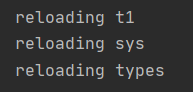

# 21.from复制变量名，不是连接

test03.py

```python
x = 99


def printer():
    print x
```

test02.py

```python
from test03 import x, printer

x = 100
printer()
```

运行test02，结果：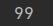

此时发现x的值并没有修改，这印证了from是复制变量名，而不是连接

解决方法

test02.py

```python
import test03 as t

t.x = 100
t.printer()
```

运行test02，结果：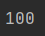

# 22.截获python运算符

>以双下划线命名的方法（__ _add_ _ _）是特殊钩子，当实例出现内置运算时，这类方法会自动调用
>
>```python
>class Test(object):
>
>def __init__(self, name):
>   self.name = name
>
>def __add__(self, other):
>   return self.name + other.name
>
>
>if __name__ == '__main__':
>a = Test("1")
>b = Test("2")
>print a + b
>```
>
>结果：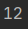
>
>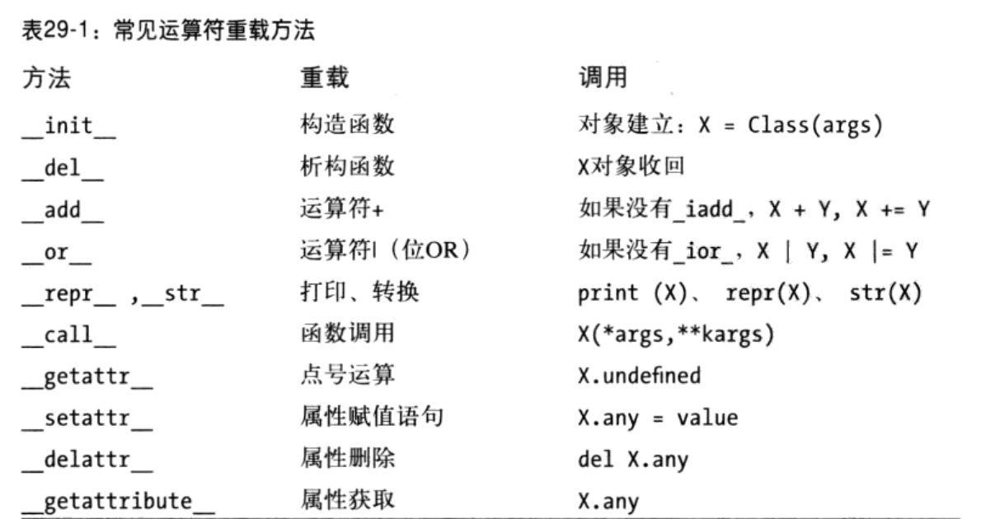
>
>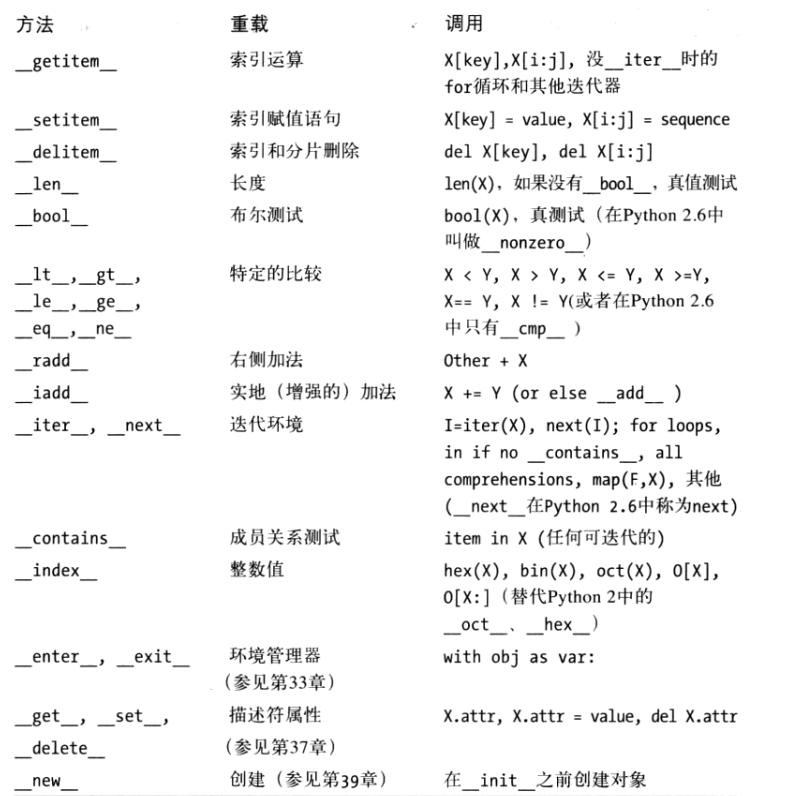
>
>详细见python学习手册（第四版）p711

# 23.对象持久化

```python
# -*- coding: utf-8 -*-
class Test(object):

    def __init__(self, name, age):
        self.name = name
        self.age = age

    def __str__(self):
        return "name: " + self.name + "   age:" + str(self.age)


import shelve

if __name__ == '__main__':
    a = Test("张三", 22)
    b = Test("李四", 20)
    db = shelve.open("Testdb")
    for obj in (a, b):
        db[obj.name] = obj
    db.close()

    db = shelve.open("Testdb")
    for obj in db:
        print db[obj]
    db.close()
```

结果：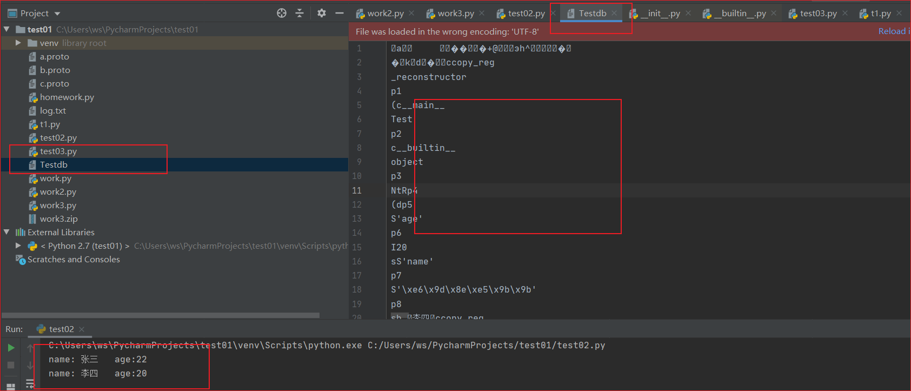

# 24.菱形继承

```python
class A:
    attr = 1


class B(A):
    pass


class C(A):
    attr = 2


class D(B, C):
    pass


# 先深度优先搜索，再广度优先搜索
if __name__ == '__main__':
    d = D()
    print d.attr
```

结果：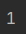

------

继承了object的新式类

```python
class A(object):
    attr = 1


class B(A):
    pass


class C(A):
    attr = 2


class D(B, C):
    pass


# 先广度优先搜索，再深度优先搜索
if __name__ == '__main__':
    d = D()
    print d.attr
```

结果：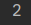

**新式类的钻石继承带来的好处：较低类可以重载较高类的属性，无论它们混入的哪种多重继承树。并且，当从多个子类访问超类的时候，新式搜索（先宽度再深度）规则避免访问同一超类**

# 25.类方法（@classmethod）

可用于每个类的实例计数器

```python
# coding=utf-8
class Spam:
    num = 0

    @classmethod
    def count(cls):
        cls.num += 1

    def __init__(self):
        self.count()


class Sub(Spam):
    # 将x = Spam()的num=1置0
    num = 0


class Other(Spam):
    # 将y1, y2 = Sub(), Sub()的num=2置0
    num = 0


if __name__ == '__main__':
    x = Spam()
    y1, y2 = Sub(), Sub()
    z1, z2, z3 = Other(), Other(), Other()
    print x.num
    print y1.num, y2.num
    print z1.num, z2.num, z3.num

```

结果：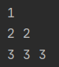

# 26.装饰器

## 26.1.方法装饰器

类似java得注解

```python
# -*- coding: utf-8 -*-

# 将m1函数得参数str前面加一串"head____"
def myHead(func):
    # *args是m1函数得参数(元组)，分别为self,str
    def inner(*args):
        args_list = list(args)
        # 参数str
        args_list[1] = "head____" + args_list[1]
        p = tuple(args_list)
        return func(*p)

    return inner


class Test(object):
    @myHead
    def m1(self, str):
        print str

    def m2(self, str):
        print str


if __name__ == '__main__':
    t1 = Test()
    t1.m1("hello")
    # 等价于上面得注解
    t2 = Test()
    m3 = myHead(Test.m2)
    m3(t2, "hello")

```

结果：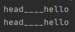

## 26.2.类装饰器

```python
# -*- coding: utf-8 -*-
def decorator(cls):
    class Wrapper:
        def __init__(self, *args):
            self.wrapped = cls(*args)

        # 拦截"."运算符
        def __getattr__(self, item):
            return getattr(self.wrapped, item)

    return Wrapper


@decorator
class Test:
    def __init__(self):
        self.str = "spam"


if __name__ == '__main__':
    x = Test()
    print x.str

```

结果：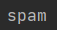

## 26.3.装饰器嵌套

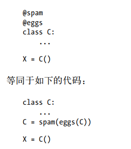

## 26.4.装饰器参数

```python
# -*- coding: utf-8 -*-
def rangetest(**kwargs):
    def onDecorator(func):
        def onCall(*pargs, **kargs):
            # **kwargs装饰器参数，*pargs, **kargs被标记装饰器的函数参数
            assert pargs[1] >= kwargs["a"][0] and pargs[1] <= kwargs["a"][1] if kwargs.get("a",None) is not None else True, "a 的取值范围有问题~"
            assert pargs[2] >= kwargs["b"][0] and pargs[2] <= kwargs["b"][1] if kwargs.get("b",None) is not None else True, "b 的取值范围有问题~"
            assert pargs[3] >= kwargs["c"][0] and pargs[3] <= kwargs["c"][1] if kwargs.get("c",None) is not None else True, "c 的取值范围有问题~"
            return func(*pargs, **kargs)

        return onCall

    return onDecorator


class Test:
    def __init__(self):
        pass

    @rangetest(a=(1, 5), c=(5, 6))
    def m1(self, a, b, c):
        print a, b, c


if __name__ == '__main__':
    x = Test()
    x.m1(1, 2, 3)

```

结果：

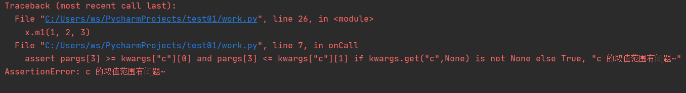

# 27.异常

```python
# -*- coding: utf-8 -*-
fobj = None
try:
    filename = raw_input("Enter file name: ")
    fobj = open(filename, "r")
    for eachLine in fobj:
        print eachLine,
except IOError, e:
    print "file open error:", e
    # if fobj is None:
    #     raise e
    # assert后面得表达式为False才抛出AssertionError和对应异常，和上面raise等价
    assert fobj is not None, e
else:
    # 和except分支二选一
    print "没抓到异常"
finally:
    if fobj is not None:
        fobj.close()
```

结果：

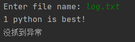

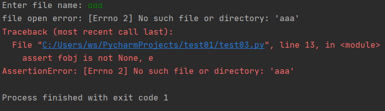

------

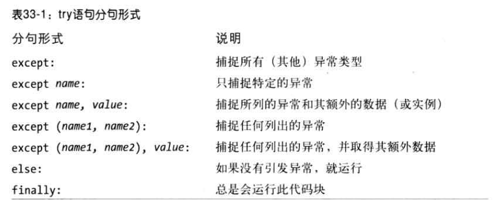